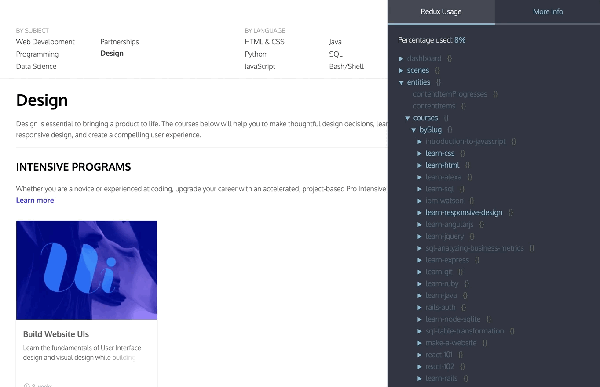

# Redux Usage Report

This library tracks the way your app is actually using the data in your Redux store. By setting up the monitor in devtools you can see a live view of when different parts of your store are accessed:



To find out exactly when a certain value is being accessed, you can [set a breakpoint](#set-a-breakpoint) to explore the call stack when the app touches that particular value.

You can also use `redux-usage-report` as a performance tool to [find unnecessarily fetched data in your app.](#find-unused-data)


## Demo
[Try it out on the TodoMVC app here.](https://elite-orange.surge.sh/?debug_session=test)

## Quickstart


### 1. Install the required libs

```js
yarn add redux-usage-report redux-devtools redux-devtools-dock-monitor
```

### 2. Create the DevTools component

Create a file called `DevTools.js` (or whatever you'd like to call it) and paste the following code in:
```js
import React from "react";
import { createDevTools } from "redux-devtools";
import DockMonitor from "redux-devtools-dock-monitor";
import { UsageMonitor } from "redux-usage-report";

export default createDevTools(
  <DockMonitor
    toggleVisibilityKey="ctrl-h"
    changePositionKey="ctrl-q"
    changeMonitorKey="ctrl-m"
  >
    <UsageMonitor />
  </DockMonitor>
);

```

### 3. Add the `generateReduxReport` and the `DevTools.instrument` store enhancers to your store:

*Make sure to put the `DevTools.instrument()` call last in the order of composed functions.*

Your code might look something like this:

`configureStore.js`
```js
import { createStore, applyMiddleware, compose } from "redux"
import thunk from 'redux-thunk'
import generateReduxReport from "redux-usage-report"

import rootReducer from "./reducers"
import DevTools from './DevTools';

const enhancer = compose(
  applyMiddleware(thunk),
  generateReduxReport(),
  // DevTools.instrument() must go last
  DevTools.instrument()
  )

const store = createStore(rootReducer, initialState, enhancer)
```

### 3. Render `<DevTools/>` into the app

The easiest way to do this is just render the `<DevTools/>` component in your App component.

[Read more about setting up redux devtools in the official documentation.](https://github.com/gaearon/redux-devtools/blob/master/docs/Walkthrough.md)

Please make sure to [only include the devtools for your development build!](https://github.com/gaearon/redux-devtools/blob/master/docs/Walkthrough.md#exclude-devtools-from-production-builds)


### 4. Temporarily disable the Redux Devtools browser extension
For the in-app `Redux Devtools` monitor to work, your `Redux DevTools` browser extension must be disabled (otherwise there are 2 copies trying to run at the same time).

## How to use it

The json view of your store will show the parts that have been not accessed at reduced opacity, as well as an estimate of the total percentage of your store that has been used so far by your app. (The percentage is calculated by comparing the string length of the `json` comprising the used portion of the store, with the `json` string containing the entire store.)

## Set a breakpoint

You can set a breakpoint by doing `shift + click` on any key in the json view. The next time the key is accessed, the debugger will stop execution. Feel free to reload the page, the breakpoint will persist until you remove it by holding `shift` and clicking it again.


## Find unused data

*Note: This works best in Chrome.*

Load the monitor in the app as described above, and visit all pages you want to test. Make sure to perform any required UI interactions to trigger data fetching or data usage. Then, open your browser console and type

```js
copy(reduxReport.generate().unused)
```

You can now paste that `JSON` object into a file to see which parts of your redux store have remained completely untouched. You might be able to get rid of some data fetching entirely, or simply be more thoughtful about when data is fetched, in order to speed up your app.


## How it works

The `generateReduxReport` enhancer wraps the store in a proxy, so that each object access can be tracked.

It tries to be smart about ignoring object accesses that come from outside your app's code. For instance, if you're also using the `persistStore` Devtools plugin, even though that plugin accesses every key in your store, you shouldn't see that reflected in the Usage Report monitor. The monitor attempts to filter out object access that originates in any module located in the `node_modules` folder or from a browser extension. This filtering logic only works in Chrome, or failing that, if you are using something like the [eval option](https://webpack.js.org/configuration/devtool/#development) or some other lightweight type of source map that preserves file pathnames in stacktraces.

If you are curious as to why a value is marked "accessed", you can always `shift + click` the relevant key in the monitor to set a breakpoint.

## Performance
If you notice any performance issues, (you probably will in an app with a larger redux store) you can speed things up by turning off the most expensive check (whether to ignore object access that originates from `node_modules`) by typing in the console:
 ```
 reduxReport.__skipAccessOriginCheck = true
 ```
