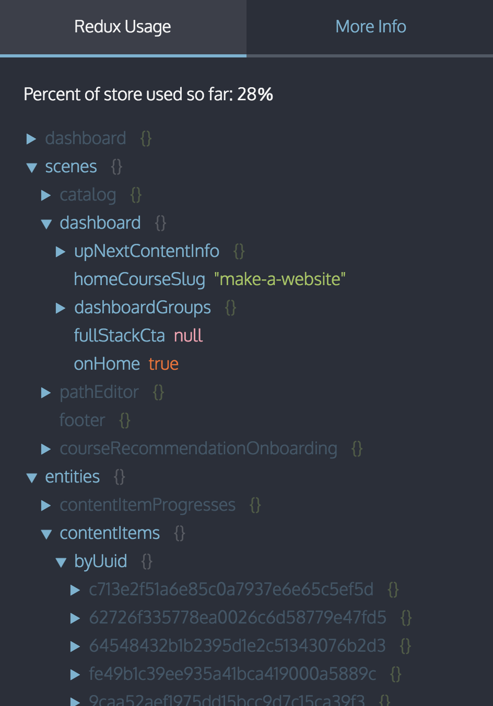

# Redux Usage Report

This library tracks the way your app is using the data in your Redux store. By setting up the monitor in devtools you can see a live view of when different parts of your store are accessed:


If you want to know exactly when a certain value is being accessed, you can set a breakpoint to explore the call stack when the app touches that particular value.

## Demo
[Try it out on the TodoMVC app here.](https://elite-orange.surge.sh/)

## 1. Install the required libs

```js
yarn install redux-usage-report redux-devtools redux-devtools-dock-monitor
```

## 2. Create the DevTools component

`DevTools.js`
```js
import React from 'react';
import { createDevTools } from 'redux-devtools';
import DockMonitor from 'redux-devtools-dock-monitor';
import { UsageMonitor } from 'redux-usage-report';

export default createDevTools(
  <DockMonitor toggleVisibilityKey='ctrl-h'
               changePositionKey='ctrl-q'
               changeMonitorKey='ctrl-m'>
    <UsageMonitor />
  </DockMonitor>
);

```

## 3. Add the `DevTools.instrument` and the `generateReduxReport` store enhancers

`configureStore.js`
```js
import { createStore, applyMiddleware, compose } from "redux"
import rootReducer from "platform/state/reducers"

import generateReduxReport from "redux-usage-report"
import DevTools from '../DevTools';

const enhancer = compose(
    generateReduxReport(),
    DevTools.instrument()
  )

const store = createStore(rootReducer, initialState, enhancer)
```

## 3. Render `<DevTools/>` into the app

The easiest way to do this is just render the `<DevTools/>` component in your App component.

[Read more about setting up redux dev tools here.](https://github.com/gaearon/redux-devtools/blob/master/docs/Walkthrough.md)

**Make sure to [only include the devtools for your development build](https://github.com/gaearon/redux-devtools/blob/master/docs/Walkthrough.md#exclude-devtools-from-production-builds)!**

## How to use it

The json view of your store will show the parts that have been not accessed at least once at half opacity:



You can set a breakpoint by doing `shift + click` on any key. The next time the key is accessed, the debugger will stop execution. Feel free to reload the page, the breakpoint will persist until you remove it.


## How it works

The generateReduxReport enhancer wraps the store in a proxy, so that each object access can be tracked.

It tries to be smart about ignoring object accesses that come from outside your app's code, for instance from the React devtools extension or another redux store enhancer, by not recording object access that originates in any module located in the `node_modules` folder or from any browser extension. This filtering logic only works in Chrome, or failing that, if you are using something like the [eval option](https://webpack.js.org/configuration/devtool/#development) or some other lightweight type of source map.

If you are curious as to why a value is marked "accessed", you can always `shift + click` it in the monitor to set a breakpoint.
