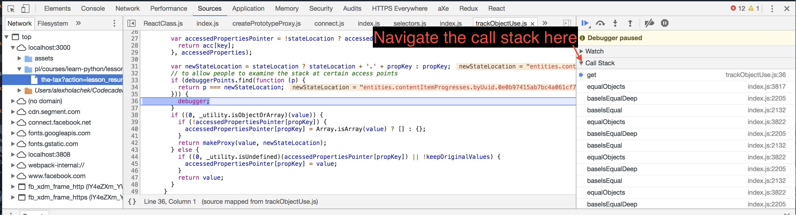

# Redux Usage Report

This library allows you to replace a generic object with a proxied object and track which parts of the object are accessed. I made it to help me track which parts of the store were actually being used on various parts of a large Redux application.

It could also have other applications, such as quickly creating a minimal stub data object for tests by tracking which parts of the object the test actually requires.

It exports two functions: the generic helper `trackObjectUse`, and `generateReduxReport`.

They make use of ES2015 proxy functionality to record when an object property is accessed.

**To install:** `yarn install redux-usage-report`

## 1. Simple Object Wrapper: `trackObjectUse`

### Basic Example:
```
import { trackObjectUse } from 'redux-usage-report'

const obj = {
  a: [1, 2, 3, 4],
  b: {
    e: [1, 2, 3, 4],
    c: { d: [1, 2, 3, 4] }
  }
}
const { trackedObject, accessedProperties } = trackObjectUse(obj)

const access1 = trackedObject.a[0]
const access2 = trackedObject.b.c.d[2]

console.log(accessedProperties)

// { a: [1], b: { c: { d: [undefined, undefined, 3] } } }
```

By default it keeps the `accessedProperties` object as close as possible to the original state of the `trackedObject`. If you'd like `accessedProperties` to update as `trackedObject` is updated you can pass in an option:

```
const { trackedObject, accessedProperties } = trackObjectUse(obj, { keepOriginalValues : false})
```

### Generate Stub Data Example:

First, record the minimum object required by the test:
```
import fs from 'fs'
import { trackObjectUse } from 'redux-usage-report'
import hugeStubData from './stubData.json'

describe('a complex item selector', () => {
  it('returns some item', () => {
    const { trackedObject, accessedProperties } = trackObjectUse(hugeStubData)
    const result = complexItemSelector(trackedObject, { itemId })

    fs.writeFile(`./minimal_stub_data.json`, JSON.stringify(accessedProperties), err => {
      if (err) throw err
    })
  })
})
```

Then remove the object tracking code from the test and use the new, smaller stub data file instead of the original stub data.

## 2. Redux Store Usage Tracker: `generateReduxReport`

### Basic Example:
```
import { generateReduxReport } from 'redux-usage-report';
import { combineReducers } from 'redux';
... rest of imports

const rootReducer = combineReducers({
  // ... reducers go here
});

if (process.env.NODE_ENV === 'development') {
  // provide reference to the global object as the first argument
  export default generateReduxReport(window, rootReducer);
} else {
  export default rootReducer
}

```
Once your rootReducer is wrapped, you open up your console when the app is running and type
`reduxReport.generate()` to view an object that looks like:

```
{
  used : { a : 1, b : 2},
  unused : {c : 3}
}
```
You can peruse the `unused` object to see which parts of state might (possibly, not necessarily) be redundant for that part of the app.

### Debugging Example

When you use the `reduxReport.generate` function, you might want to see why certain parts of the store are marked `used`. It's possible that they are accessed simply as a side effect, for instance when doing a deep comparison of state in a `PureComponent` or something similar.
In order to investigate further, you can provide a third argument to `generateReduxReport`:  an array of redux paths that, when accessed, should trigger a debugger statement so that you can explore the call stack. The paths should be in the form:

```
"a.b.c.2.d"
```
With index arrays provided as numbers.

Here's an example from a real project:

```
if (process.env.NODE_ENV === 'development') {
  export default generateReduxReport(window, rootReducer, ['entities.contentItemProgresses.byUuid.0e0b97415ab7bc4a061cf703dff8d93a.started']);
}
```

You can then proceed to check out the functions in the call stack to see when this value is actually getting accessed in your application:



### Integration Test Stub Data

Finally, `reduxReport.generate` can also be used to create a stubdata object for Redux integration tests as demoed in [this test](./__tests__/generateReduxReportTest.js)

Definitely don't use this library in production!

## Disclaimer

There are a bunch of edge cases that are not handled particularly well at the moment...
